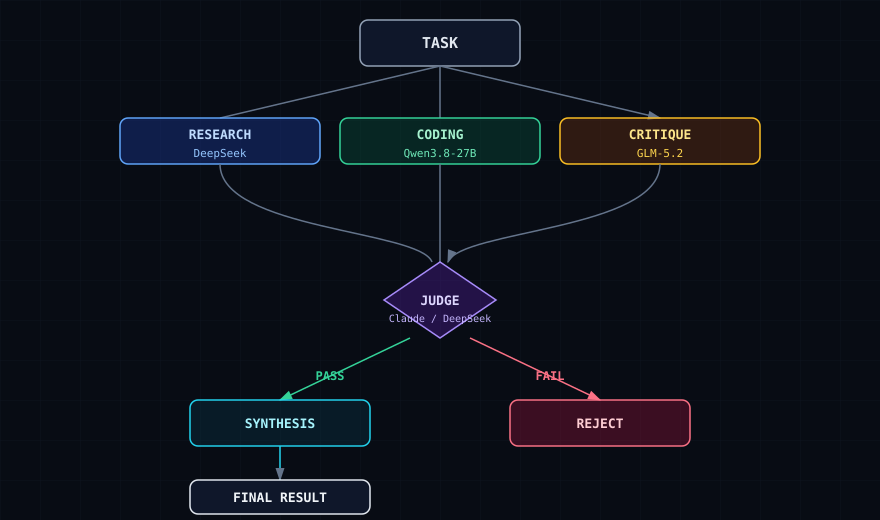

# Multiple Models, One Task

**Run ONE task through MULTIPLE specialized models in parallel — a coder model writes code, a strong generalist critiques it, a reasoner synthesizes — then a judge checks before it reaches you.**

A single LLM told to "act as coder, then reviewer, then judge" is still ONE model with ONE blind spot. When the coder and the reviewer are the same weights, the reviewer can't catch what the coder missed. This project makes the experts *real* — each role runs on the model actually good at that role.

```
                        TASK
                          │
        ┌─────────────────┼─────────────────┐
        ▼                 ▼                 ▼
   RESEARCH          CODER            CRITIC
  reasoner-model    coder-model    strong-generalist
        │                 │                 │
        └─────────────────┼─────────────────┘
                          ▼
                       JUDGE
                          │
                          ▼
                      SYNTHESIS → final answer
```



## The point

| | One model doing everything | Multiple models + judge |
|---|---|---|
| Code review | nobody checks | critic finds real bugs before you ship |
| Blind spots | one model's weakness = your bug | a different model catches it |

In one real run: a local coder model wrote clean validation, a second model found 8 problems it missed (duplicate machines, reserved IPs), synthesis fixed them. **The combination beat either model alone.**

## Contents

- `SKILL.md` — the full skill (context, concept, architecture, pitfalls, when-not-to-use, minimal example)
- `src/` — reference TypeScript implementation (20 files, compiles with `tsc --noEmit` = 0 errors)
- `diagram.svg` — dark SVG diagram
- `docs.md` / `examples.md` / `tests.md` — architecture notes, usage examples, test cases (extracted raw)

## Install the skill

```bash
cp SKILL.md ~/.hermes/skills/multiple-models-one-task/
```

## Verification request

This is a draft re-assembled from a long design conversation. If you try it: does per-expert assignment actually beat a single model? Does the judge catch real bugs? Open an issue with your before/after.

## License

MIT
