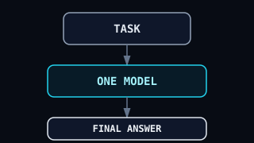
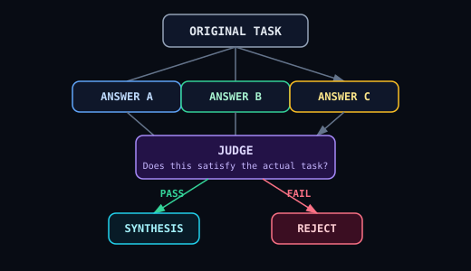

# Different Minds, One Task

### Different families. Different blind spots. One verified result.

A task is decomposed into specialized roles and executed by models from **different families** — each chosen for what it does best. Different quantizations of one model don't count: they share the same weights and the same blind spot. Independence comes from different families.

Research is handled by one model.
Code by another.
Critique by another.

A separate **Judge** evaluates the results against the original task, and only validated work reaches the final **Synthesis** stage.

> **The goal is not to make one model do everything better.**
>
> **The goal is to stop one model from being the only model looking at the problem.**

---

## The core idea

Most LLM systems look roughly like this:



That architecture has a fundamental limitation:

**the same model that makes the decision is also responsible for detecting its own mistakes.**

Multiple Models, One Task uses a different approach:


The important part is not simply **multiple models**.

It is **different models performing different cognitive roles**.

---

## Why different families?

Running the same model three times does not create three independent perspectives.

If the model has a blind spot, all three instances may share it.

The same holds for different quantizations of one model. Qwen Q4, Q8 and Q2 have the same weights, only different precision — the same knowledge, the same blind spot. Quantization changes the file size, not the way the model fails.

Independence requires a different **family**: Qwen vs GLM vs Claude vs DeepSeek — different training, different data, different ways of failing.

The system therefore supports per-role model assignment:

| Role           | Model             | Purpose                                               |
| -------------- | ----------------- | ----------------------------------------------------- |
| **Researcher** | DeepSeek Reasoner | Explore the problem, patterns and relevant approaches |
| **Coder**      | Qwen3.8-27B       | Produce concrete implementation                       |
| **Critic**     | GLM-5.2           | Challenge assumptions and find weaknesses             |
| **Judge**      | Claude / DeepSeek | Evaluate results against the original task            |
| **Synthesis**  | Strong generalist | Combine validated results into the final answer       |

The exact models are configurable. The architecture does not depend on one provider.

---

# How it works

A task enters the system through a **Planner**.

The planner decomposes it into expert roles and creates instructions for each one.

Experts can declare:

* dependencies
* priorities
* execution constraints
* allowed models

The execution engine then determines what can run in parallel and what must wait.


Execution supports:

* **Sequential** execution
* **Parallel** execution
* **Hybrid** execution with dependencies respected
* Concurrency limits
* Dependency validation
* Cycle detection
* Immediate failure on invalid plans

A dependency cycle should fail immediately rather than leave the system waiting indefinitely.

---

# The Judge is a gate

The Judge does not simply compare answers with each other.

It evaluates each result against the **original task**.

This distinction matters.



Only validated results are allowed into synthesis.

This prevents a plausible-looking but incorrect expert response from automatically becoming part of the final answer.

---

# A real example

The system was tested against a `parseClusterConfig` implementation.

The coder produced an implementation that looked complete.

It handled:

* IPv4 syntax
* leading-zero rejection
* role validation
* non-negative GPU counts
* indexed validation errors

A single-model workflow could reasonably have stopped there.

The independent critic found additional problems.

### 8 issues missed by the coder

```text
01  Duplicate machines were allowed
02  Reserved IP addresses were accepted
03  Arrays could pass the object check
04  An unsafe type cast happened before validation
05  Whitespace could leak into stored names
06  An empty cluster could pass
07  An orchestrator was not required
08  Error messages did not always describe the real failure
```

The critic also identified dead validation logic and missing bounds.

The synthesis stage incorporated the corrections.

The important result was not that one model was "bad".

The important result was that:

> **the coder and critic failed differently.**

That is exactly the property this architecture is designed to exploit.

---

# Architecture

The system is split into two major layers.

## Composition layer

The composition layer decides **what should happen**.

```text
┌─────────────────────────────────────────────┐
│              COMPOSITION LAYER              │
│                                             │
│  Planner                                    │
│  Expert Registry                            │
│  Model Assignment                           │
│  Dependency Graph                           │
│  Execution Engine                            │
│  Judge                                       │
│  Synthesis                                   │
│  Policy                                      │
│  Observability                              │
│  Evaluation                                  │
│                                             │
└─────────────────────────────────────────────┘
```

### Planner

Decomposes the task into expert roles.

### Expert Registry

Defines available experts, their capabilities and allowed models.

### Model Assignment

Assigns a model **per expert**, rather than globally.

### Dependency Graph

Controls relationships between expert tasks.

Supports:

```text
dependsOn
priority
cycle detection
```

### Execution

Supports sequential, parallel and hybrid execution.

### Judge

Validates expert outputs against the original task.

### Synthesis

Combines validated results into the final result.

---

## Runtime layer

The runtime layer decides **where and how the work runs**.

```text
┌─────────────────────────────────────────────┐
│                 RUNTIME LAYER               │
│                                             │
│  Model Registry                             │
│  Resource Placement                         │
│  GPU / RAM / CPU                            │
│  Automatic GPU tuning                       │
│  Quantization / Context                     │
│  Benchmarking                               │
│  llama.cpp                                  │
│  Ollama                                     │
│  Cloud APIs                                 │
│                                             │
└─────────────────────────────────────────────┘
```

This separation means the cognitive architecture does not need to know exactly where a model runs.

A model can be:

* local
* GPU accelerated
* CPU based
* hosted through an API
* served through llama.cpp
* served through Ollama

---

# Per-expert model assignment

Model selection is deliberately not global.

For example:

```ts
const plan = {
  task: "Analyze the architecture and propose improvements.",

  executionMode: "hybrid",

  experts: [
    {
      id: "research",
      expertId: "researcher",
      instruction: "Analyze existing patterns."
    },

    {
      id: "coder",
      expertId: "coder",
      instruction: "Identify concrete code changes."
    },

    {
      id: "critic",
      expertId: "critic",
      instruction: "Find weaknesses.",
      dependsOn: ["research", "coder"]
    }
  ],

  assignments: [
    {
      expertId: "researcher",
      modelId: "deepseek-reasoner"
    },

    {
      expertId: "coder",
      modelId: "qwen3.8-27b"
    },

    {
      expertId: "critic",
      modelId: "glm-5.2"
    }
  ],

  judgeExpertId: "judge",
  synthesisExpertId: "synthesis"
};
```

The architecture therefore separates:

```text
WHAT SHOULD BE DONE
        │
        ▼
     EXPERT
        │
        ▼
WHICH MODEL SHOULD DO IT
        │
        ▼
    EXECUTION
```

This makes model replacement possible without redesigning the task architecture.

---

# Why not just use one bigger model?

A larger model can absolutely be better.

And this architecture does **not** claim that multiple models are always superior.

There are real trade-offs:

| Approach                    | Advantage                | Cost                         |
| --------------------------- | ------------------------ | ---------------------------- |
| One model                   | Simple, fast, cheap      | Shared blind spots           |
| Same model × multiple calls | More attempts            | Usually shared failure modes |
| Multiple different models   | Independent perspectives | More latency and cost        |
| Multi-model + Judge         | Validation + diversity   | Highest complexity           |

For simple tasks, a single strong model is usually the correct engineering choice.

For high-value or failure-sensitive tasks, additional independent reasoning can justify the overhead.

---

# When this architecture makes sense

Good candidates include:

* complex software engineering
* architecture reviews
* code generation + review
* security analysis
* research-heavy tasks
* technical decision making
* large refactoring
* configuration validation
* tasks where silent errors are expensive

Poor candidates include:

* trivial questions
* simple transformations
* low-risk single-step tasks
* latency-critical requests
* workloads where additional model calls are not justified

Sensitive information also requires careful isolation because sending the same data to multiple models can increase the exposure surface.

---

# What this project is really about

This is not primarily a "multi-agent" framework.

It is an attempt to separate several things that are often mixed together:

```text
TASK
 │
 ├── decomposition
 │
 ├── expertise
 │
 ├── model selection
 │
 ├── execution
 │
 ├── independent evaluation
 │
 └── synthesis
```

The central design principle is:

> **Different cognitive roles should not automatically share the same model.**

And a second principle follows:

> **The model producing an answer should not be the only model deciding whether that answer is good enough.**

---

# Repository

```text
multiple-models-one-task/
│
├── src/
│   └── TypeScript implementation
│
├── references/
│   └── architecture and reference material
│
├── README.md
├── SKILL.md
├── diagram.svg
├── docs.md
├── examples.md
└── tests.md
```

The reference implementation currently consists of the core TypeScript architecture under `src/`, with the broader doctrine, examples and API material separated into the supporting documentation.

---

# Implementation status

The reference implementation currently covers:

* task planning
* expert registration
* per-expert model assignment
* dependency graphs
* execution modes
* concurrency control
* cycle detection
* judging
* synthesis
* policy
* observability
* evaluation
* runtime model registry
* resource placement
* hardware-aware tuning
* benchmarking
* local and cloud backends

The implementation is TypeScript and is designed to compile under strict TypeScript settings.

---

# Try the pattern

Start with a task that is difficult enough for independent perspectives to matter.

For example:

```text
"Review this parser implementation for correctness,
security issues, edge cases and architectural problems."
```

Then assign:

```text
RESEARCHER → investigate known patterns and failure modes

CODER      → inspect the implementation and propose fixes

CRITIC     → independently attack the proposed solution

JUDGE      → evaluate every result against the original task

SYNTHESIS  → produce the final validated result
```

The interesting question is not:

> "Which model is smartest?"

It is:

> **"What happens when models with different strengths and different failure modes are forced to evaluate the same problem from different directions?"**

---

# License

MIT
